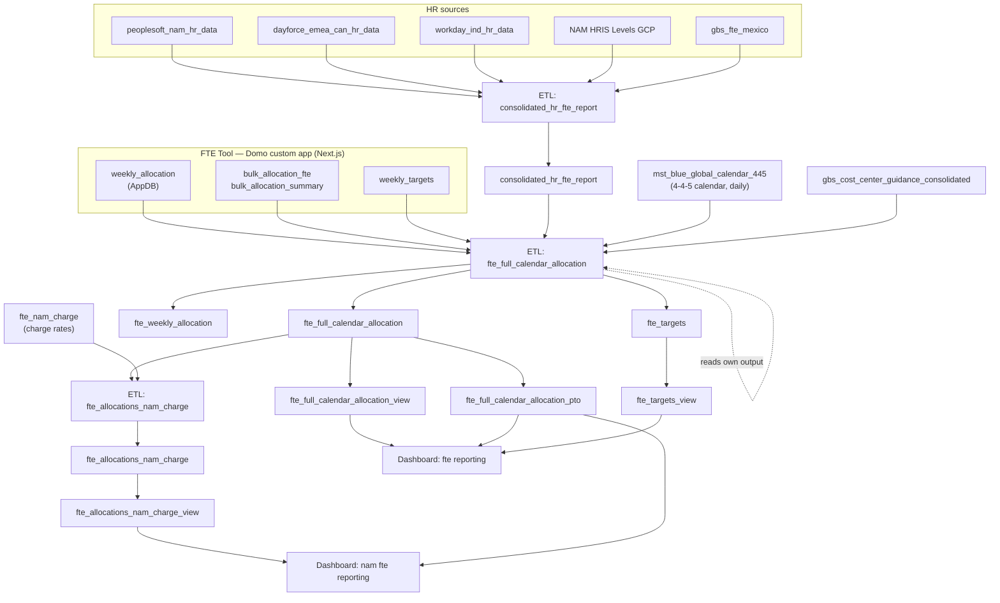

# FTE Reporting — ownership handover

Everything needed to take over the FTE reporting dashboards in Domo: what feeds them, what each
card computes, what is known to be wrong, and what breaks what.

**Compiled** 2026-08-13 from live exports of the dataflows and dashboard pages.
**Outgoing owner:** Alex Paratore. **Content owner group:** `content owner - GBS FTE tool`.

> **Read §1 before anything else.** There are two Domo environments running the same dashboard
> design with completely different GUIDs. Knowing which one you are looking at is a prerequisite for
> everything else in this document.

---

## Contents

1. [Environments — read first](#1-environments--read-first)
2. [System overview](#2-system-overview)
3. [The source application](#3-the-source-application)
4. [The dataflows](#4-the-dataflows)
5. [Datasets and views](#5-datasets-and-views)
6. [Concepts you must understand](#6-concepts-you-must-understand)
7. [Dashboard: `fte reporting`](#7-dashboard-fte-reporting)
8. [Dashboard: `nam fte reporting`](#8-dashboard-nam-fte-reporting)
9. [Beast Modes](#9-beast-modes)
10. [Known defects](#10-known-defects)
11. [What breaks what](#11-what-breaks-what)
12. [Runbook](#12-runbook)
13. [Open questions](#13-open-questions)

---

## 1. Environments — read first

The same dashboard exists in at least two Domo environments. Card titles, layout, section headers
and colours are identical; **every GUID differs**, including the Beast Mode ids.

| | Environment A (documented earlier) | Environment B (these exports) |
|---|---|---|
| `fte reporting` page | `1551650036` | `1981930666` |
| Allocation view | `eeba8836-7e01-4bb7-bc3f-73915fce5523` | `4d9d03d8-2fc3-4752-9a3e-001f14efff45` |
| Targets view | `0c0ae204-d9dc-4dc8-924c-b2a789e3922d` | `e4dd884e-0301-47a6-be15-63bd1d3a3700` |
| PTO view | `9f43ac77-723c-4ab2-9d16-2d03057701ba` | `789261cb-7341-4eed-b1bd-87f47479fd5c` |
| Owner id on cards | `1607643452` | `1427260956` |
| Beast Mode ids | e.g. `…679ac87e` (`allocation_monthly`) | e.g. `…c3044639` (same role) |

**This document describes Environment B**, because that is what the current exports show and what the
supplied dataflows publish into. Environment A is documented separately in
[`domo_reporting_dashboard.md`](domo_reporting_dashboard.md).

**First task for the incoming owner:** establish which environment is production, whether A is a
sandbox or an abandoned fork, and whether changes have to be applied twice. Nothing in either surface
flags the divergence, and a fix applied to one leaves the other untouched.

The app deploys to `randstad-sbxb.domo.com` (sandbox). Whether the dashboards live in the same
instance is unconfirmed.

---

## 2. System overview



Three dataflows, four published datasets, four views, two dashboards, 29 cards.

---

## 3. The source application

A Domo custom app (Next.js), source at `github.com/alex-paratore-randstad/fte_tool`. Managers enter
allocations; the app writes AppDB collections that the main dataflow reads.

| Collection | Written by | Grain |
|---|---|---|
| `weekly_allocation` | Weekly Allocation grid | one doc per person × cost centre × week |
| `bulk_allocation_fte` / `bulk_allocation_summary` | Bulk Allocation | monthly profile → members + cost-centre split |
| `weekly_targets` | Weekly Targets | quarterly targets |

Behaviour that matters downstream:

- **`allocation_date` is the Monday** that starts the week, even though the grid shows users a
  week-ending date. A user editing "W/E Aug 2" is editing the row whose date is `2026-07-27`.
- **A blank cell means no document exists.** Clearing a cell hard-deletes the AppDB document.
- **`0` is a real value.** As of app version 0.0.44, a user can type `0` and it persists as
  `allocation_amount = "0"`. Blank still deletes. This distinction was added specifically to fix
  §10.1 — see that section for what it does and does not solve.
- **`baseline_fte_value` and `correction_month`** are written when a user edits a week belonging to a
  closed month. This is how retroactive corrections are recorded, and it is what feeds the
  `previous_fte_value` column and the corrections cards.
- **A superseded edit is not always removed.** The app can create a duplicate document if a user
  saves twice in one session without reloading; the dataflow's `rank` column exists to handle this.

---

## 4. The dataflows

### 4.1 `consolidated_hr_fte_report` (Magic ETL)

Publishes `consolidated_hr_fte_report` → `6d199fbe-6a26-479f-8a0f-aae022372648`, **REPLACE**.

Unions five regional HR systems into one roster, normalising wildly different schemas:

| Source | Region | Filtered to |
|---|---|---|
| `peoplesoft_nam_hr_data` | NAM | `DESCR IN ('RPO MSP Admin Talent','RPO Sourcing Delivery','RPO Admin Delivery')` |
| `NAM HRIS Levels GCP` | NAM | six `dept_descr` values |
| `dayforce_emea_can_hr_data` | EMEA | `Area = 'Delivery Center'` and `Site <> 'Supply Chain'` |
| `workday_ind_hr_data` | APAC (India) | GBS L3 hierarchy, excluding Global BPO and Coaching & Outplacement |
| `gbs_fte_mexico` | NAM (Mexico) | none — whole file |

Then: `Add Formula 4` copies `department` to `Department Detail`; **`cleaned status and department`**
does the real normalisation (status → active/inactive, ~30 department-detail values → 9 buckets,
country spellings, `fte` null → `'1'`); `Filter Rows 4` drops rows with no `person_id` or no
`manager`; `Filter Rows 3` keeps `end_date IS NULL OR end_date >= '2026-06-29'`; `Rank & Window 1`
+ `Filter Rows 6` keep one assignment per person (active first, then latest `start_date`);
`Remove Duplicates` on `(full_name, person_id, start_date)`.

**Things to know.** `missing_flag` is set per source with different logic — job-title regex in EMEA
and Mexico, a department list in NAM, a hierarchy check in India. It means "this person is a manager
and is not expected to log allocations", and the `missing allocations` cards filter on it. Mexico has
no employee id at all, so ids are synthesised as `CONCAT('mex', row_num)` ordered by email — **these
ids are not stable across runs** if the source row set changes. `Filter Rows 3`'s `'2026-06-29'` is a
hardcoded date. One manager name is hardcoded (`Karen Ann Welch` → `Karen Welch`).

### 4.2 `fte_full_calendar_allocation` (Magic ETL) — the main flow

Publishes three datasets, all **REPLACE**:

| Output | GUID | Fed by | Grain |
|---|---|---|---|
| `fte_weekly_allocation` | `6455057d-dca9-41ee-8fa4-19322ed5ba8d` | `Join Data 4` | one row per allocation document |
| **`fte_full_calendar_allocation`** | `0ce8e039-d17a-4af9-911d-6d96ff6f7e2e` | `Alter Columns 3` | **person × Monday × cost centre**, including weeks with nothing logged |
| `fte_targets` | `6346b2b2-4830-4671-a890-a158ae89bb51` | `String Operations` | one row per targets document |

**Weekly branch.** `weekly_allocation` → tag `allocation_type = 'weekly'` → union with bulk →
strip the `[id] ` prefix from `allocation_name` → LEFT JOIN to HR on name → `Rank & Window` adds
`rank` (partitioned by `allocation_date, allocation_name, cost_center_name, allocation_type`,
ordered `__created__ DESC`) → `Add Formula 2` sets `fte = IFNULL(fte, 1.0)`, picks the department
source by allocation type, and sets **`previous_fte_value = baseline_fte_value`** → cost-centre
guidance join.

**Bulk branch.** `bulk_allocation_fte ⨝ bulk_allocation_summary` → drop `UNALLOCATED` →
count employees per profile → **INNER join to calendar Mondays on
`allocation_monthyear = DATE_FORMAT(DATE_ADD(Day, INTERVAL 4 DAY), '%b %Y')`** → count weeks per
profile → `allocation_amount = amount / num_weeks / employee_count`.

So a profile holding 3.0 FTE for a client, covering 6 people, in a 4-week month, yields
`3.0 / 4 / 6 = 0.125` on each Monday for each person. **The month is decided by the week's Friday**,
i.e. the Gregorian axis — see §6.3.

**The skeleton.** Calendar Mondays (`Calendar Reporting Year >= 2026` and `<= YEAR(now)+1`)
CROSS JOIN the roster = every employee × every in-window Monday, with `skeleton_cost_center =
'Unassigned'`. `Join Data 7` LEFT OUTER joins the real allocations on `(full_name, person_id, Day)`.
**Note the join key has no cost centre** — see §10.1.

**`Add Formula 5` — the semantics tile.** Expressions run in listed order and later ones see earlier
results:

| # | Column | Expression | Purpose |
|---|---|---|---|
| 1 | `allocation_amount` | `NULL → 0.0` | unmatched skeleton rows become zero |
| 2 | `allocation_staus` | 4-branch CASE | see §6.5 |
| 3 | `fte` | `'1' → 1.0` | guards a string arriving from HR |
| 4 | `cost_center_name` | `COALESCE(…, skeleton_cost_center)` | unmatched → `'Unassigned'` |
| 5 | `rank` | `NULL → 1` | skeleton rows join the rank-1 population |
| 6 | `allocation_type` | `NULL → 'placeholder'` | tags synthetic rows |
| 7 | `department` | `placeholder ? placeholder_department : department` | **depends on #6 having run** |
| 8 | `person_email` | `lower(…)` | |

**Reordering #6 and #7 in the Domo UI silently breaks department attribution.**

**The tail.** `Join Data 8` attaches `Calendar Reporting Month Date`; `String Operations 1` trims
`cost_center_name`; `Add Formula 8` derives `week_end_greg = Day + 4 days` and
`month_greg = DATE_TRUNC('month', week_end_greg)`; then the history mechanism below.

**The self-referencing history mechanism.** The flow reads **its own previous output** —
`fte_full_calendar_allocation_input` points at `0ce8e039`, the same GUID it publishes to. It takes
`manager`, `department`, `manager_email` per `(person_id, Day)`, de-duplicates on that pair, LEFT
joins, and `Add Formula 9` does `COALESCE(historical_x, x)`.

Intent: freeze org structure as it was when a week was first reported, so a reorg does not restate
history. Consequence: **whatever value a `(person_id, Day)` receives on its first published run wins
permanently.** A bad run does not self-heal on re-run — correcting it means clearing the input
dataset or a one-off run with the COALESCE bypassed. Test structural changes against a scratch output
dataset first.

`Add Formula 9` also writes `last_updated` as a **formatted string**, not a timestamp.

### 4.3 `fte_allocations_nam_charge` (Magic ETL)

Publishes `fte_allocations_nam_charge` → `b3ae5634-262d-4746-bdaf-f77cc15133ee`, **REPLACE**.

Six tiles. Filters `fte_full_calendar_allocation` to `fte_country = 'United States of America'` **or**
`'Canada'` (two filter entries = OR), lowercases the email on `fte_nam_charge`, and LEFT JOINs on
`person_email = Employee Email Address` to attach `Charge Rate`.

Fragile in one specific way: the join is on email, and the charge-rate file is maintained by hand.
A person whose email changes, or is absent from the file, silently gets a NULL charge rate and drops
out of any revenue calculation without an error.

---

## 5. Datasets and views

| View | GUID (Env B) | Over | Used by |
|---|---|---|---|
| `fte_full_calendar_allocation_view` | `4d9d03d8-…` | `fte_full_calendar_allocation` | fte reporting — 10 cards |
| `fte_targets_view` | `e4dd884e-…` | `fte_targets` | fte reporting — 2 cards |
| `fte_full_calendar_allocation_pto` | `789261cb-…` | `fte_full_calendar_allocation` | both dashboards — 2 cards |
| `fte_allocations_nam_charge_view` | `a83d3d23-…` | `fte_allocations_nam_charge` | nam fte reporting — 8 cards |

**The view definitions were not exported and are not documented.** They matter: the allocation view
exposes a column called `Reporting Month Gregorian` that the base dataset calls `month_greg`, so at
least one view renames columns. The PTO view presumably filters to PTO cost centres, but the filter
is unconfirmed. **Exporting these four view definitions is the highest-value gap to close.**

---

## 6. Concepts you must understand

### 6.1 `rank = 1` is the deduplication key

The dataset holds **every version** of every allocation document. `rank = 1` is the newest;
`rank > 1` are superseded edits that were never deleted. Almost every card filters `rank = 1`.
**A card that sums `allocation_amount` without it counts superseded edits** — see §10.2.

### 6.2 `allocation_type` decides the population

| Value | Meaning |
|---|---|
| `weekly` | entered in the Weekly Allocation grid |
| `bulk` | exploded from a monthly bulk profile onto that month's Mondays |
| `placeholder` | synthetic skeleton row — person-week with nothing logged, amount `0` |

Cards reporting *what was allocated* filter `IN ('bulk','weekly')`. Cards reporting *coverage* need
the placeholders. Note that on `fte level allocations`, the card filter admits `placeholder` but the
slicer excludes it by default — so users see the narrow population unless they clear the slicer.

### 6.3 Two time axes, and the two dashboards use different ones

| Axis | Columns | Rule |
|---|---|---|
| **Gregorian** | `week_end_greg` (the Friday), `month_greg` / `Reporting Month Gregorian` | a week belongs to the month containing its **Friday** |
| **Fiscal 4-4-5** | `Day`, `Reporting Week Date` (the Sunday), `Calendar Reporting Month Date`, `Reporting Month Date` | looked up from the master calendar |

They disagree at boundaries. The week starting Mon 2026-07-27 is **fiscal August** but
**Gregorian July**.

- **`fte reporting` reports on the Gregorian axis.**
- **`nam fte reporting` reports on the fiscal axis** — its header says so explicitly.

The same underlying number will differ between the two dashboards in any boundary month. That is by
design, but nobody reading one of them can tell. The bulk explosion (§4.2) uses the **Gregorian**
rule, which means bulk rows are dense on the Gregorian axis and *not* on the fiscal one.

The Gregorian rule is duplicated in the app (`OWNING_MONTH_OFFSET_DAYS = 4` in
`src/lib/fiscal-calendar.ts`) and in two ETL tiles. If one changes and the others don't, the month a
user fills in stops being the month reported on.

### 6.4 Corrections

When a user edits a week in a closed month, the app records the pre-edit amount as
`baseline_fte_value` and the month the correction cycle started as `correction_month`. The ETL
surfaces the former as `previous_fte_value`. The corrections cards show rows where the current and
previous amounts differ and the row was modified this calendar month.

This replaced an earlier design that inferred the previous value from document ordering. The current
design is explicit and does not depend on duplicate documents existing.

### 6.5 `allocation_staus` (spelled that way in the flow)

```sql
CASE
  WHEN IFNULL(allocation_amount, 0) = 0 AND fte > 0 THEN 'No Logs Entered'
  WHEN IFNULL(allocation_amount, 0) < fte           THEN 'Under-Allocated'
  WHEN IFNULL(allocation_amount, 0) > fte           THEN 'Over-Allocated'
  ELSE 'On Target'
END
```

It compares **one cost-centre row** against the person's **whole** FTE. A person correctly allocated
1.0 but split 0.6/0.4 across two clients produces **two `'Under-Allocated'` rows**. It is only
meaningful after `allocation_amount` has been summed to person-week level.

---

## 7. Dashboard: `fte reporting`

Page `1981930666` · parent `1261493680` · internal `pageName` = `alerts` · background `#0F1941`,
section headers `#BAD808`.

19 cards: 13 data, 6 text dividers. `PB` marks a print page break.

| Order | Card | id | Type | Source |
|---|---|---|---|---|
| 1 | dataset last updated (UTC) | 1136521350 | single value | allocation view |
| 2 | Total FTEs | 1147894975 | single value | allocation view |
| 3 | Allocated FTEs | 390455741 | single value | allocation view |
| 4 | **allocations** | 979331715 | text | |
| 5 | total allocations | 356045511 | multi bar | allocation view |
| PB | | | | |
| 6 | client roll up | 911852408 | pivot + big number | allocation view |
| 7 | fte level allocations | 184728100 | pivot | allocation view |
| PB | | | | |
| 8 | over / under allocation | 1984232073 | pivot | allocation view |
| 9 | missing allocations by manager | 1462533056 | pivot | allocation view |
| PB | | | | |
| 10 | month over month change by client | 659593651 | pivot | allocation view |
| 11 | **corrections** | 1777108902 | text | |
| PB | | | | |
| 12 | previous month corrections | 1038605280 | pivot | allocation view |
| 13 | **governance** | 324743655 | text | |
| PB | | | | |
| 14 | manager activity | 1135499081 | basic table | allocation view |
| 15 | **targets** | 794244009 | text | |
| PB | | | | |
| 16 | fte targets | 1856836430 | stacked bar | targets view |
| 17 | fte targets table | 740866118 | pivot | targets view |
| PB | | | | |
| 18 | **pto** | 373562795 | text | |
| 19 | pto table | 233285129 | pivot | PTO view |

The three summary badges sit **above** the first section header, so they belong to no section.
`month over month change` falls under **allocations**, not corrections, despite reading like a
corrections card.

**Cards that ignore the page date filter:** previous month corrections, month over month change, both
targets cards, dataset last updated. The last also ignores all page filters — correct, it is a
freshness indicator.

### Card detail

**dataset last updated (UTC)** — `MAX(last_updated)`, no filters. `last_updated` is a
`dd/mm/yyyy hh:mm AM` **string**, so `MAX()` is lexicographic. Harmless only because the flow
REPLACEs and every row carries the same value. The "(UTC)" label is unverified — the ETL writes
`CURRENT_TIMESTAMP()`, whose timezone follows the instance setting.

**Total FTEs** / **Allocated FTEs** — both `dcount_person`, a distinct count of `person_id`. "Total"
has no filters (whole roster in the window); "Allocated" filters `rank = 1`. Neither is a sum of FTE
despite the labels. Together they give coverage.

**total allocations** — `SUM(allocation_amount)` by month, series `cost_center_name`, current
quarter. **Filters `allocation_type` only — no `rank = 1`.** See §10.2.

**client roll up** — big number `SUM(allocation_amount)`; pivot rows `cost_center_name`,
`Account Region`, `P&L country`, `service type`, `Opco Tagetik`, `Invoiced entity`; columns month ×
`fte_country` × `department`; value `allocation_monthly`. Current month, `rank = 1`. The big number
is a plain sum while the grid cells are a weekly *average* — different units on one card.

**fte level allocations** — rows `full_name`, `person_id`, `fte_country`, `department`,
`fte level cost center name`, `cost_center_number`; columns month × `week_end_greg`; value
`allocation_monthly`. Admits `placeholder` in its filter but excludes it in the default slicer.
Two department-ish columns sit side by side and mean different things — see §10.3.

**over / under allocation** — rows `full_name`, `manager`, `fte_country`; value `allocation_check`
plus `AVG(fte)` and `SUM(allocation_amount)`; filtered to non-zero variance. `AVG` is the
de-duplication device: `fte` repeats on every cost-centre row, so averaging recovers the single value
while the amount legitimately sums.

**missing allocations by manager** — rows `manager`, `full_name`; measures `fte2` ("assigned fte"),
`SUM(allocation_amount)` ("allocated fte"), `missing fte allocations`. Filters `missing_flag = 0`,
`rank = 1`; **no `allocation_type` filter**, deliberately, because this card is about absence. Its
description says "default date is previous month" but the configuration is the **current** month —
the configuration wins. The two FTE-side measures de-duplicate differently; see §10.4.

**month over month change by client** — rows `cost_center_name`, columns month; `SUM(allocation_amount)`
plus `Net Change MoM`. Rolling 3 months.

**previous month corrections** — rows `fte_country`, `department`, `allocation_name`, `manager`,
`cost_center_name`, `cost_center_number`; measures current allocation, previous allocation, and the
delta. Filters: `current_month_flag = 1`, delta not in `('', 0)`, `rank = 1`, date range = previous
month. The mechanism is clean — the date range restricts to rows *reported for* last month and
`current_month_flag` to rows *edited* this month; the intersection is exactly a retroactive
correction.

**manager activity** — `manager`, `MAX(__created__)` ("last allocation date"),
`days since last allocation`. Sorted by staleness descending, heatmapped. The `NOT IN ('')` filter is
load-bearing: placeholder rows have no AppDB document and therefore null timestamps. **The two
adjacent columns use different timestamp columns** — see §10.5.

**fte targets** / **fte targets table** — `SUM(allocation_amount)` from the targets view by fiscal
quarter. The table adds cost-centre hierarchy rows and `fte_country` × `department` columns, current
year. Both drill through to cards not on this page (`790319402`, `1309369940`) whose definitions were
not exported.

**pto table** — from the PTO view; rows person/manager/country/department, columns
`month_greg` × `week_end_greg`, `SUM(allocation_amount)` as "pto fte", `rank = 1`, current month.
Note it uses `month_greg` directly where every other card on this page uses
`Reporting Month Gregorian` — most likely the same column named differently by the two views.

---

## 8. Dashboard: `nam fte reporting`

Page `543239663` · parent `1261493680` · same background and header colours.

10 cards: 8 data, 2 text dividers. Reads `fte_allocations_nam_charge_view` (which is already filtered
to US + Canada) plus the shared PTO view.

| Order | Card | id | Type | Source |
|---|---|---|---|---|
| 1 | **nam fte reporting (based on 4-4-5 calendar)** | 20810839 | text | |
| 2 | total allocations nam | 1696488878 | multi bar | nam charge view |
| PB | | | | |
| 3 | nam client roll up | 1093140541 | pivot + big number | nam charge view |
| 4 | nam fte level allocations | 990314959 | pivot | nam charge view |
| PB | | | | |
| 5 | missing allocations by manager nam | 1115375352 | pivot | nam charge view |
| 6 | month over month change by client nam | 4535886 | pivot | nam charge view |
| PB | | | | |
| 7 | **corrections** | 229450524 | text | |
| 8 | previous month corrections nam | 1624066000 | pivot | nam charge view |
| 9 | **pto** | 1885639321 | text | |
| PB | | | | |
| 10 | pto table nam | 1066754456 | pivot | PTO view |

This is the same analytic set as the main dashboard, minus the badges, targets and governance
sections, plus charge rates — and **on the fiscal axis throughout** (`Calendar Reporting Month Date`,
`Reporting Week Date`, `CalendarMonth`) rather than the Gregorian one.

Differences worth knowing:

- **`nam fte level allocations`** carries `AVG(Charge Rate)` as a **row dimension** (unusual — an
  aggregate in a row position) and a second measure, `calculation_1928813c`, which is almost
  certainly FTE × charge rate. Confirm before relying on it.
- **`pto table nam`** reads the shared PTO view and filters `region CONTAINS 'NAM'` — so it depends on
  `region`, which the HR flow sets per source. Mexico rows are tagged `'NAM'`, India `'APAC'`,
  EMEA `'EMEA'`.
- **`missing allocations by manager nam`** and **`previous month corrections nam`** default to the
  **previous** month, where their counterparts on the main dashboard default to the current month.
- **`total allocations nam`** filters `allocation_type` only, with no `rank = 1` — the same defect as
  its counterpart on the main dashboard. See §10.2.

---

## 9. Beast Modes

Every calculation is per-environment; the ids below are Environment B's, mapped to their role by
where they are used. **The formula text for Environment B was not exported** — the formulas in
[`_domo_export/beast_modes.md`](_domo_export/beast_modes.md) are Environment A's. They are expected
to be identical but this is an assumption, not a fact. **Confirm before relying on any of them.**

### `fte reporting` (10)

| Role | Env B id | Formula (from Env A — verify) |
|---|---|---|
| `dcount_person` | `…d28c0dcb` | `COUNT(DISTINCT person_id)` |
| `allocation_monthly` | `…c3044639` | `SUM(allocation_amount) / COUNT(DISTINCT Day)` |
| `allocation_check` | `…978e20f6` | `SUM(allocation_amount) - AVG(fte)` |
| `change in allocation` | `…bd43e89c` | `previous_fte_value - allocation_amount` |
| `current_month_flag` | `…71991855` | `LAST_DAY(__modified__) = LAST_DAY(CURRENT_DATE())` → 1/0 |
| `fte2` | `…1c70ccfb` | `SUM(fte) / NULLIF(COUNT(DISTINCT cost_center_name), 0)` |
| `missing fte allocations` | `…054572a4` | `SUM(allocation_amount) - SUM(fte)` |
| `Net Change MoM` | `…5e828d42` | `SUM(amount) - LAG(SUM(amount)) OVER (PARTITION BY cost_center_name ORDER BY Calendar Reporting Month Date)` |
| `days since last allocation` | `…901a4e07` | `DATEDIFF(CURRENT_DATE(), MAX(__modified__))` |
| `fte level cost center name` | `…ff6b16f3` | `CASE WHEN allocation_type = 'bulk' THEN department ELSE cost_center_name END` |

### `nam fte reporting` (9, formulas unknown)

| Role (inferred from position) | Env B id |
|---|---|
| fte allocation (monthly average) | `…fd68e718` |
| month column | `…6c9c1521` |
| fte level cost centre name | `…023b4622` |
| second measure — likely FTE × charge rate | `…1928813c` |
| assigned fte | `…4f52f36e` |
| missing fte allocations | `…cfec1f69` |
| Net Change MoM | `…550d9d14` |
| change in allocation | `…0b641cab` |
| current month flag | `…ee56f30c` |

**To capture these:** Beast Mode Manager → filter to this dataset → the list response gives names and
ids; open each to read the formula.

---

## 10. Known defects

Ordered by impact. All are live unless stated.

### 10.1 Monthly averages divide by weeks-with-data, not weeks-in-month

**Cards:** `fte level allocations`, `client roll up`, and their NAM counterparts.

`allocation_monthly` is `SUM(allocation_amount) / COUNT(DISTINCT Day)`. A blank week is an **absent
row**, not a zero, so it never enters the denominator. A person allocated 1.0 to a client in 3 of a
4-week month shows a month total of **1.00 instead of 0.75**, and anyone split across cost centres
over-reports — their rows sum to more than their FTE.

Root cause is the skeleton grain: `Join Data 7` joins on `(full_name, person_id, Day)` with **no cost
centre**, so it never manufactures a row for a cost centre the person holds elsewhere in the month.
The `'Unassigned'` placeholder rows only appear when a person has nothing at all that week, and they
sit on a *different pivot row*.

**Partially fixed.** App 0.0.44 lets users enter an explicit `0`, which persists and reaches
reporting attached to its cost centre. **This only fixes weeks somebody actually zeroes.** Untouched
weeks and all existing history are unchanged. Expect the symptom to persist until managers adopt the
habit — treat a continuing over-report as a data-entry gap before treating it as a bug.

A downstream SQL dataflow that would close the gap completely (and backfill history) was written and
**shelved**: [`domo_sql/`](domo_sql/). It was never successfully run.

### 10.2 `total allocations` counts superseded edits

**Cards:** `total allocations` (356045511) and `total allocations nam` (1696488878).

Both filter `allocation_type` only — **no `rank = 1`**. Every superseded version of every edited
allocation is included in the bars. These are the most prominent charts on each dashboard, and the
only cards that sum `allocation_amount` without the rank guard.

**Fix:** add `rank = 1` to each card's filters. The numbers will drop; the current ones are inflated,
not the corrected ones deflated.

### 10.3 `department` means two things on one card

The bulk branch maps `allocation_group → department`, so on `bulk` rows that column holds the bulk
profile's group label, not the HR department. `fte level cost center name` exists to work around
exactly this. But `fte level allocations` displays **both** `department` and
`fte level cost center name` as adjacent row dimensions: on a weekly row they read as (HR department,
cost centre); on a bulk row as (bulk group, bulk group).

### 10.4 Two measures on one card de-duplicate differently

On `missing allocations by manager`, "assigned fte" is
`SUM(fte) / NULLIF(COUNT(DISTINCT cost_center_name), 0)` — which recovers the person's real FTE.
"missing fte allocations" is `SUM(allocation_amount) - SUM(fte)`, which does **not** de-duplicate.
For anyone split across two cost centres the card shows assigned = 1.0 while the gap column
subtracts 2.0. That card has all four total/subtotal switches on, compounding it.

**Fix:** change the second to `SUM(allocation_amount) - fte2`.

### 10.5 `manager activity` mixes two timestamps

It displays `MAX(__created__)` as "last allocation date" but computes staleness as
`DATEDIFF(CURRENT_DATE(), MAX(__modified__))`. A manager who edited a March allocation yesterday
shows "last allocation date: March" next to "days since: 1". Since the card exists to surface
inactive managers and sorts on the `__modified__` column, editing old data currently resets a
manager's staleness. Decide which event the card tracks and use one column for both.

### 10.6 Grain-sensitive measures are correct at the leaf and wrong in totals

`allocation_monthly`, `allocation_check`, `fte2` and `missing fte allocations` all compensate for the
person × week × cost-centre grain in ways that only hold inside a single leaf cell. Several cards
have `total_row` / `total_col` / `subtotal_columns` on. **Grand totals on the roll-up cards are
averages over the whole visible window, so the total column is not the sum of the columns beside it.**

### 10.7 Smaller items

- **`Net Change MoM` orders its `LAG` on the fiscal axis** (`Calendar Reporting Month Date`) while the
  main dashboard's card pivots on the Gregorian one. Where the two axes disagree, the "previous"
  value is not reliably the cell to the left. On the NAM dashboard, where everything is fiscal, this
  is consistent — so this is a main-dashboard-only defect.
- **`last_updated` is a `dd/mm/yyyy` string**, so `MAX()` is lexicographic (`31/01` beats `01/12`).
  Benign only while the flow REPLACEs.
- **Stale sort overrides.** `fte level allocations` and both PTO tables carry
  `column_sort` on `Reporting Week Date` while displaying `week_end_greg` — the fiscal Sunday versus
  the Gregorian Friday. Leftover config.
- **Four Beast Modes in Environment A carry expired certification**; Environment B unchecked.
- **Mexico person ids are synthesised by row number** and are not stable across runs.

---

## 11. What breaks what

| Change | Breaks |
|---|---|
| Reordering `Add Formula 5` #6 and #7 | `department` attribution on every skeleton row, and `fte level cost center name` |
| Changing `OWNING_MONTH_OFFSET_DAYS` in the app without changing `week_end_greg` in the ETL | every card grouped on the Gregorian axis — most of `fte reporting` |
| Changing the `Rank & Window` partition or its `__created__ DESC` order | `rank = 1` on ~25 cards |
| Renaming or dropping `missing_flag` | both `missing allocations` cards return everything |
| Renaming or dropping `baseline_fte_value` | both corrections cards go empty |
| Switching `PublishToVault` off `REPLACE` | `dataset last updated`, and possibly `current_month_flag` |
| Changing the HR flow's department buckets | `department` slicers and groupings on both dashboards |
| Changing a person's email | their NAM charge rate silently becomes NULL |
| Editing a Beast Mode | leaves the other environment's copy diverged |
| Adding a cost-centre split to someone already reported | `missing fte allocations` (§10.4) |
| Re-pointing a view | every card on it — but no card needs editing, which is why views are the right seam for structural change |

---

## 12. Runbook

**A number looks wrong on a card.** Check in this order: (1) is `rank = 1` filtered? (2) which
`allocation_type` values are in scope, and does the slicer disagree with the card filter? (3) which
date axis — Gregorian or fiscal? (4) is it a total/subtotal cell of a grain-sensitive measure
(§10.6)? Most reported "bugs" are one of these four.

**Someone's allocations are missing.** Check they exist in `weekly_allocation` for the **Monday** of
that week, not the week-ending date. Then check they survive the HR join — a person absent from
`consolidated_hr_fte_report` (wrong department filter, `end_date` before the cutoff, no manager) will
not appear.

**A manager appears with no allocations.** Expected if `missing_flag = 1` — that flags managers who
are not expected to log. The flag is set differently per HR source (§4.1).

**The dashboard is stale.** Check `dataset last updated`, then the main dataflow's run history, then
the HR dataflow's — the main flow does not wait for it.

**Making a structural change to the main ETL.** Publish to a scratch dataset and compare before
cutting over. The history mechanism (§4.2) freezes first-seen values permanently, so a bad run is
expensive to undo.

**Changing a card.** Check whether the same card exists in the other environment (§1) and on the NAM
dashboard, which usually has a counterpart.

---

## 13. Open questions

Ranked by how much they would cost to leave unanswered.

1. **Which environment is production**, and does every change need applying twice? (§1)
2. **The four view definitions** — not exported, and at least one renames columns. (§5)
3. **Environment B's Beast Mode formulas** — assumed identical to A, unverified. (§9)
4. **The two drill-target cards** behind the targets cards (`790319402`, `1309369940`).
5. **What `calculation_1928813c` computes** on `nam fte level allocations` — presumed FTE × charge rate.
6. **PDP policies** on any of the four views, which would change what each card means per viewer.
7. **The hardcoded `'2026-06-29'`** in the HR flow's `Filter Rows 3` — what is it, and when does it
   need moving?
8. **Whether `fte_nam_charge` is still maintained**, and by whom.

---

## Appendix — source material

Raw exports live in [`_domo_export/`](_domo_export/). Related documents in this repo:

| Document | Covers |
|---|---|
| [`fte_full_calendar_allocation.md`](fte_full_calendar_allocation.md) | the main ETL, tile by tile, with diagnostics |
| [`domo_reporting_dashboard.md`](domo_reporting_dashboard.md) | **Environment A's** dashboard, card by card |
| [`_domo_export/beast_modes.md`](_domo_export/beast_modes.md) | Environment A's Beast Mode formulas |
| [`domo_sql/`](domo_sql/) | the shelved densification dataflow and its runbook |

The application source is `github.com/alex-paratore-randstad/fte_tool`; the allocation grid is
`src/components/allocation/multi-week-grid.tsx` and the calendar rule is `src/lib/fiscal-calendar.ts`.
